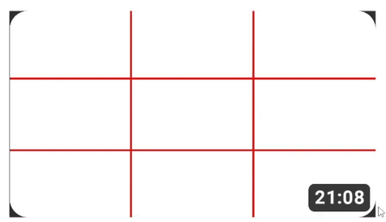
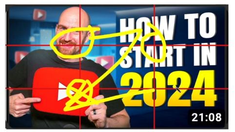

thumnail grid is the way to map the eyeball retention

##### Preview:  
  
this is a thumbnail grid, if you study this the game is yours.  
as a human we right left from right so our brain is trained to see things left to right similarly we scan the thumbnail from left to right unconsously.  

##### Preview:  
  
majority of languages are written from left to right so sublimally we scan the document in **`Z`** pattern  
`1st` priority : **Top Left Corner** -> **Top Right Corner**  
`2nd` priority : **Bottom Right Corner**  
`3rd` priority : **Bottom Left Corner**  
