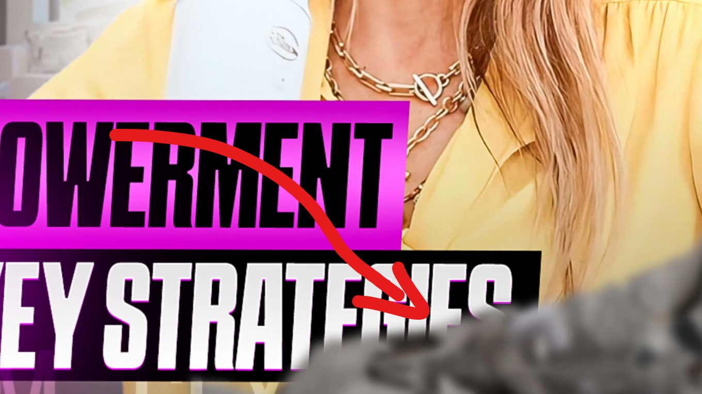

supporting element is that which is present in thumbnail but people won't even realise about that.  

### **E.g:**  
 
in this thumbnail  

  
here at bottm right there is a unknown object which is blurred it makes us focus on characters from thumbnail more.  