## Why should we even learn about types of thumbnail:  
`Thumbnail designing is not a Random Process. It is a well strategy to gain more CTR`.  
`Different type of thumbnails impact different for different niches`.  

# Types of thumbnails:  
`1) Body Cam Thumbnail`  
used to show: crime, action or surveillance, these thumbnails should intense & real lookings.  
these thumbnails are for live footage or first person footage like medical rush, police chases, military ops or trainings egency scenarios.   
##### Preview:  
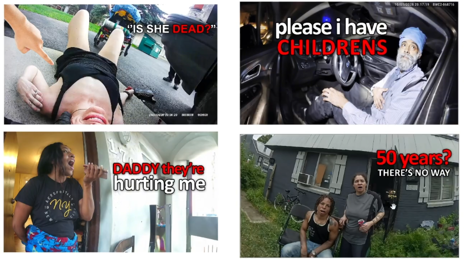  
like this thumbnail shows medical emergency scenario  
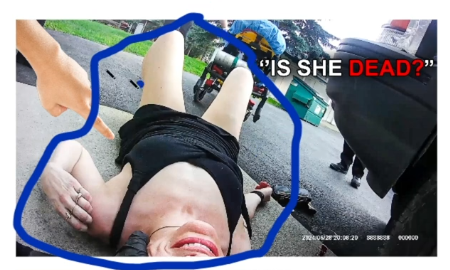  
and has written dramatic words in it  
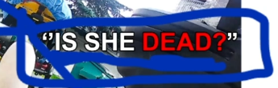  
like other thumbnail has emotion grabbing facial expression  
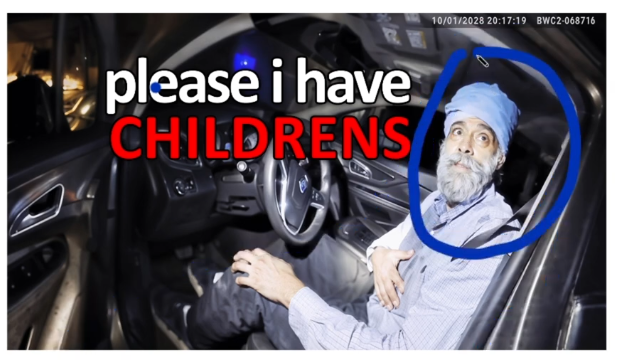  
the ideal practice is too scan actual video footage & choose the expression facial by yourself.   

`2) Podcast Thumbnails`    
clear face & expression with mic should be visible in this thumbnail  
### **E.g:**    
  
strong facial expression engages & connects to the audience  
it shows host-guest dynamics  
background should be dull  

`3) Health Niche Thumbnails`  
these thumbnails are used for fitness wellness & neutritions.  
##### Preview:  
  
  
these thumbnails should be fresh & vibrants  
  
it shows the `sense of positivity` & trust  
we can use visual elements like fruits vegetables, cardio performing figure.  
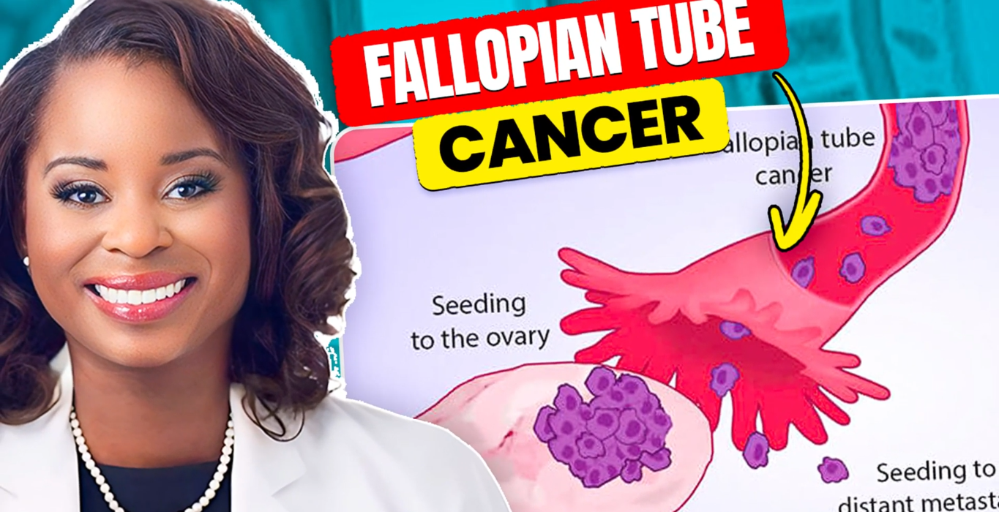  
these are meant to grab attention of health consouce people  

`4) Finance Thumbnails`  
we use these thumbnails for stock market, investments, financial advise or money making tutorials  
  
  
  
  
these should be professional & trust worthy looking  
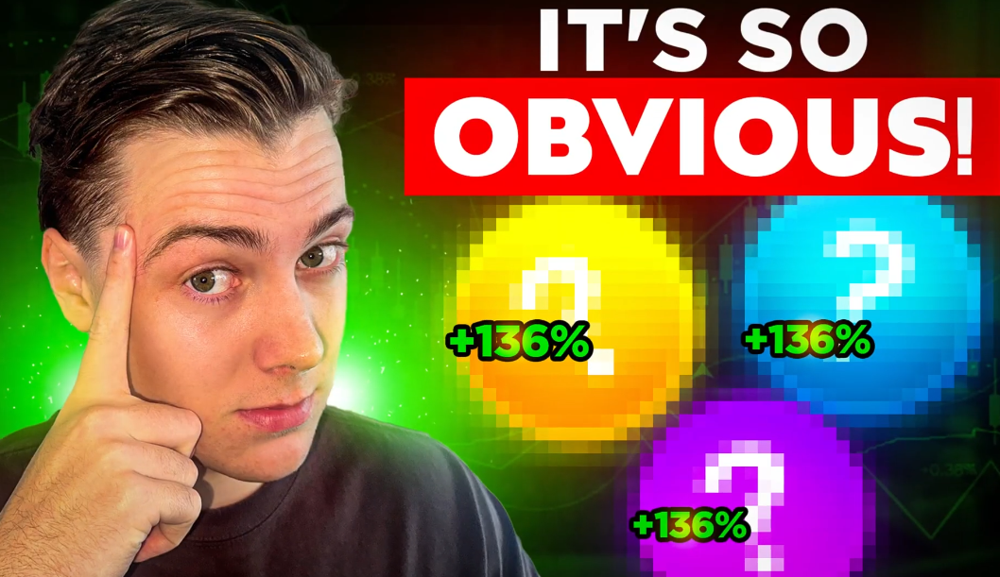  
mostly used elements like businessmen, charts, currency symbol or bank related elements  
bold, clear text is mandatory here so it gaves the viewer legit vibes  
  
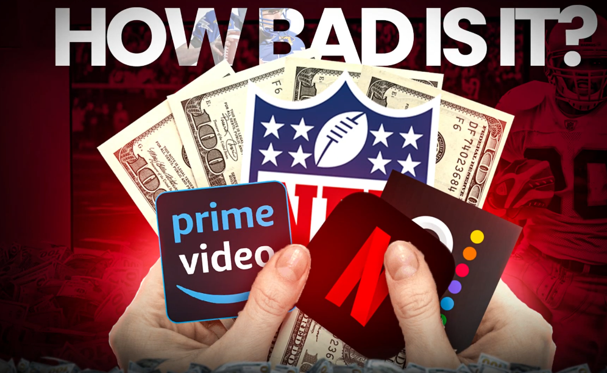  

`5) Luxury Thumbnails`  
those thumbnails focused on high-end products  
##### Preview:  
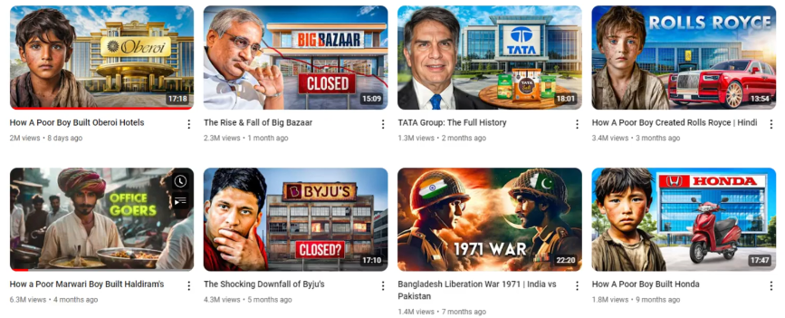  
  
  
purpose is either promote a certain brand, biography of a person, rises & downfalls etc.  
  
  

`6) Split Screen Thumbnails`  
these thumbnails are used to show 2 different sides of same story  
##### Preview:  
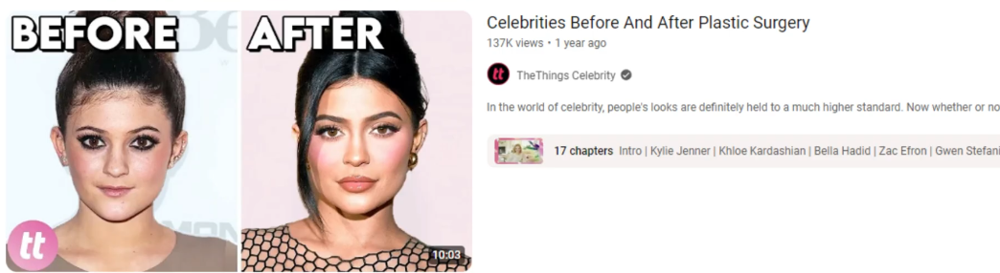  
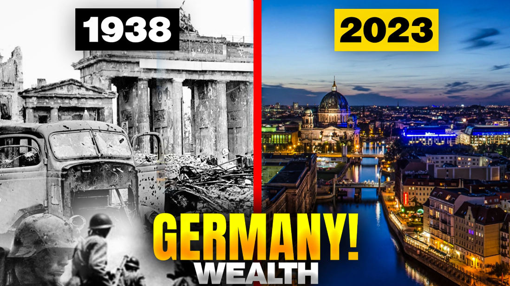  
it is comparison 2 perspective side by side  
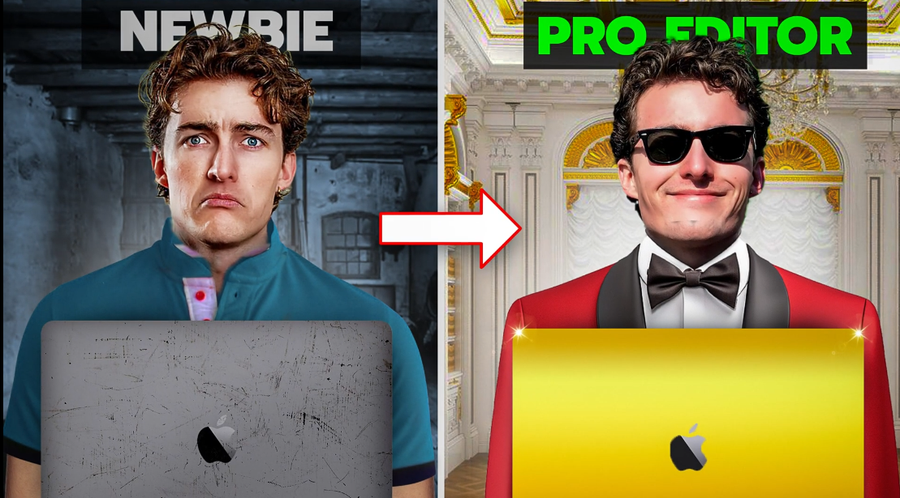  
  

`7) Gaming Thumbnails`  
  
high energy graphics, brigh colors, corcy expressions  
  
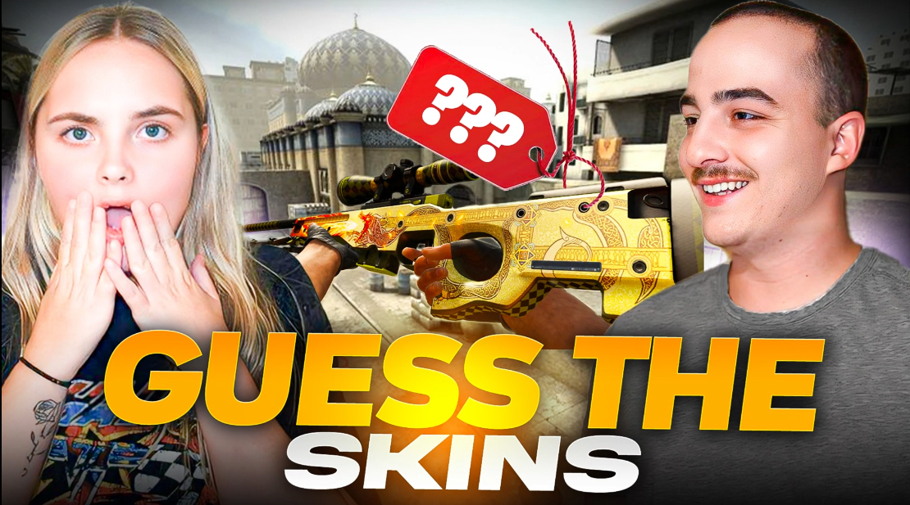  

`8) Tech Thumbnails`  
tech & gadgets taking amlost half of our screen, leaving space for corcy expression of CCer 
##### Preview:  
  
  
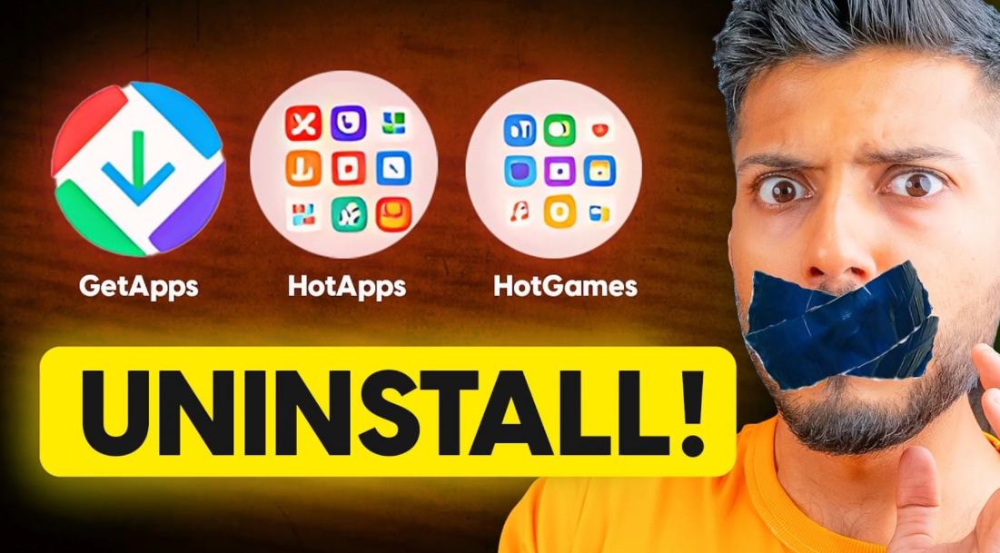  
meant for tech launch, unboxing & review  

`9) Reaction Thumbnails`  
the game of CCer's facial expression  
##### Preview:  
  
  
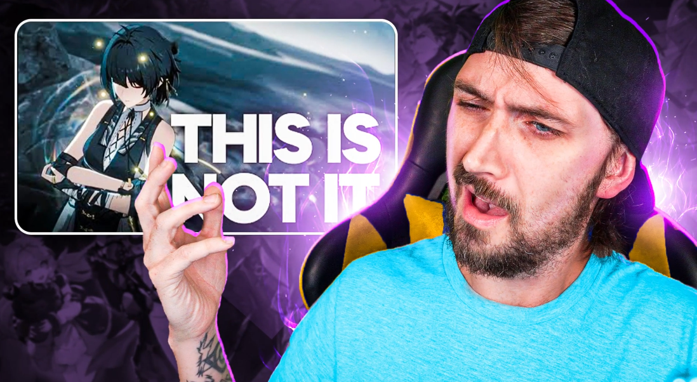  
  
  

`10) Food Thumbnails`  
vibrant looks, premium locations, comically stretchy food, saturated edible's colors  
  
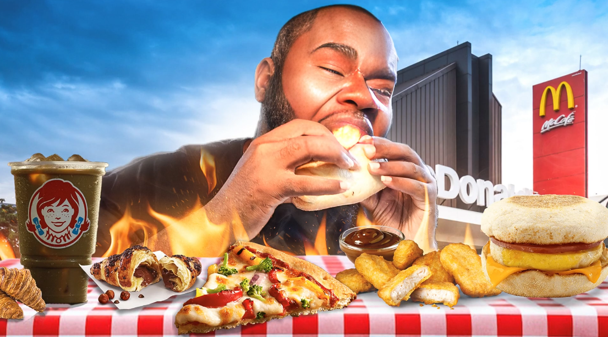  
  
  
end puspose is to mouth water viewer  

`11) Vlogging Thumbnails`  
simple yet attensive thumbnails  
  
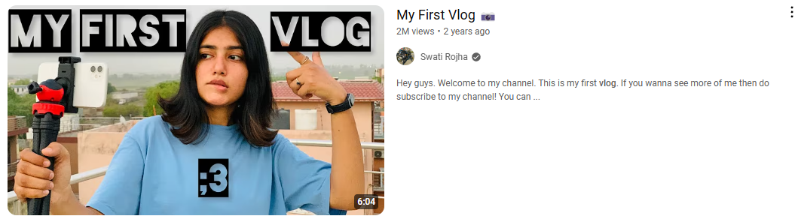  
